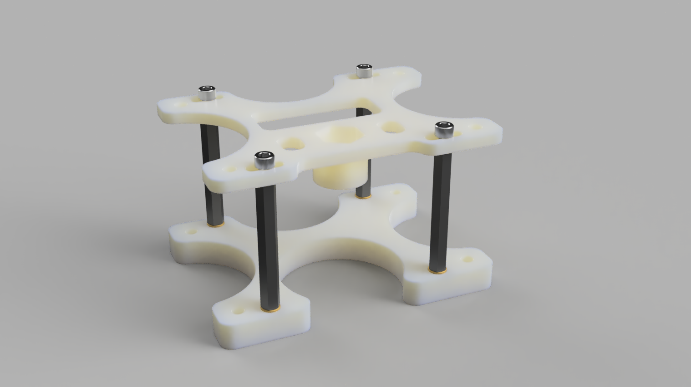
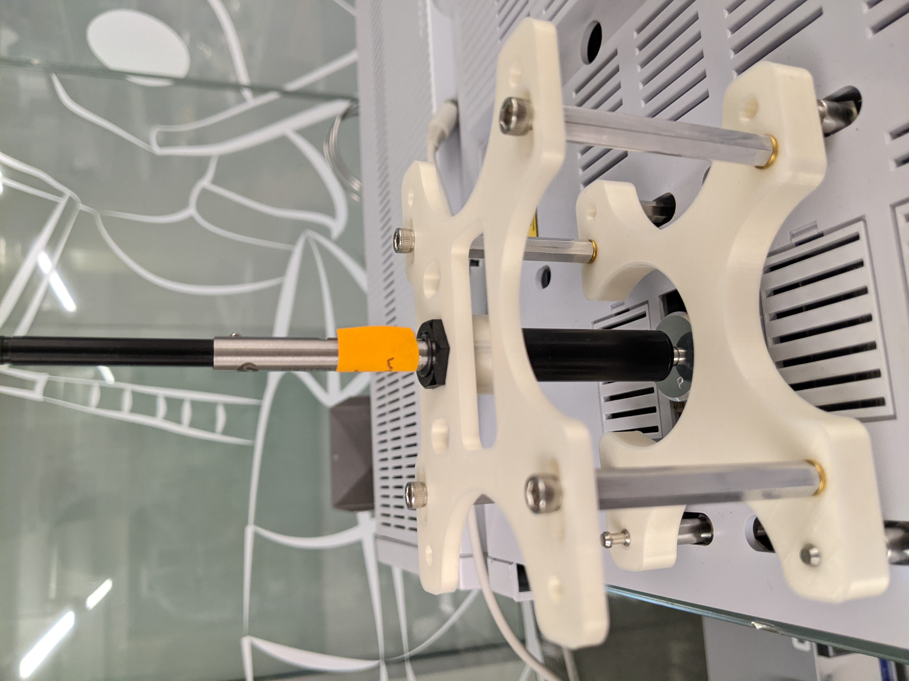
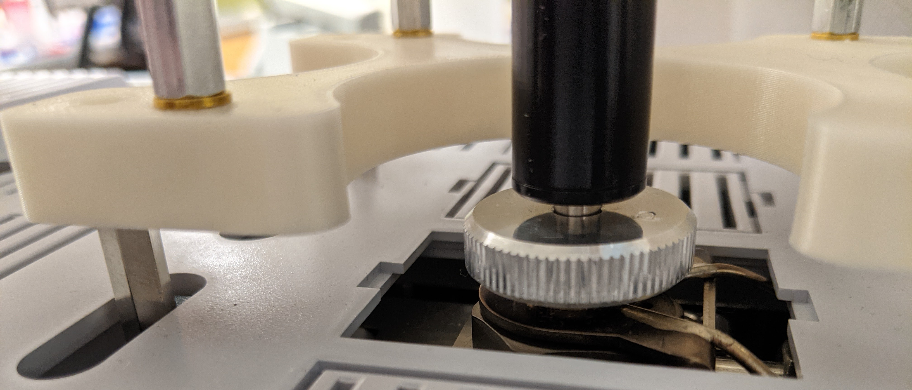

# SPME aligner

A jig for aligning the SPME needle against the GC. Prevents inadvertent chipping of the SPME fibre against the edges of the GC inlet channel.  Protects the SPME from wear-and-tear, and the GC from contamination. 

Has been tested against only the [Shimadzu GC-2010](https://www.shimadzu.com/an/products/gas-chromatography/gas-chromatograph/gc-2010-pro/index.html) and the Millipore SPME Fibre Holder ([57330-U](https://www.sigmaaldrich.com/catalog/product/supelco/57330u?lang=en&region=US&cm_sp=Insite-_-caContent_prodMerch_gruModel-_-prodMerch10-1)). 

## Hardware

### BOM

In addition to access to a 3D-printer:

| Item                                                         | Price (USD) | Quantity | Source                                                       |
| ------------------------------------------------------------ | ----------- | -------- | ------------------------------------------------------------ |
| Aluminum male-female threaded hex standoff, 1" long, 8-32 threads | 1.12        | 4        | McMaster-Carr [93505A459](https://www.mcmaster.com/93505A459/) |
| Brass heat-set inserts for plastic, flanged, 8-32 threads    | 11.69 / 50  | 4        | McMaster-Carr  [97171A150](https://www.mcmaster.com/97171A150/) |
| Stainless-steel socket head screw, 3/8" long, 8-32 threads   | 5.93 / 100  | 4        | McMaster-Carr [92196A192](https://www.mcmaster.com/92196A192/) |

### Assembly

Print one of each [`.stl`](/STLs) file and assemble like so:

The jig should press-fit snugly against the posts that would otherwise secure the autoinjector ([Shimadzu AOC-20 Series](https://www.ssi.shimadzu.com/products/gas-chromatography/aoc-series.html)).

The SPME needle should be able to reach the very bottom of the GC inlet:

## Extensions

Although this design is sufficiently functional, I would change two things for future designs:

1. I don't think using the heat-set inserts is a good idea. Installing the inserts such that they're all level is finicky, and even slight angular deviations will cause the top surface of the hex standoffs to be intolerably crooked. As much as I like the feel of metal, I think the correct strategy is to eschew the standoffs entirely, and incorporate them directly into the `bottom.stl` print. 
2. I provide degrees of freedom only along the X-axis. I should provide degrees of freedom along the Y- and Z-axes as well. 